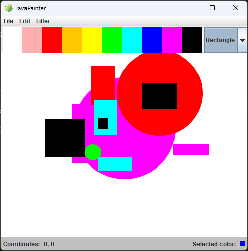

# JPainter

A Java-based drawing application that allows users to create, edit, save, and load drawings containing geometric shapes.

## Overview

JPainter is a graphical drawing application built with Java Swing that provides an intuitive interface for creating drawings with circles and rectangles. The application supports color selection, shape filtering, and file persistence using a custom `.shape` file format.

## Screenshots



## Features

- **Shape Drawing**: Create circles and rectangles with mouse interactions
- **Color Palette**: Choose from 10 predefined colors (White, Pink, Red, Orange, Yellow, Green, Cyan, Blue, Magenta, Black)
- **File Operations**:
  - Create new drawings with custom name and author
  - Save drawings to `.shape` files
  - Load previously saved drawings
- **Shape Filtering**: View all shapes, only circles, or only rectangles
- **Drawing Management**: 
  - Undo last shape
  - Edit drawing name and author
  - View drawing statistics (total area, circumference, shape count)

## Project Structure

```
jpainter/
├── src/
│   ├── App.java                                    # Main application entry point
│   └── se/miun/stab2300/dt187g/jpaint/
│       ├── Drawing.java                            # Drawing model class
│       ├── DrawingException.java                   # Custom exception
│       ├── Drawable.java                           # Drawable interface
│       ├── FileHandler.java                        # File save/load operations
│       ├── geometry/
│       │   ├── Point.java                          # Point coordinates
│       │   ├── Shape.java                          # Abstract shape class
│       │   ├── Circle.java                         # Circle implementation
│       │   └── Rectangle.java                      # Rectangle implementation
│       └── gui/
│           ├── JPaintFrame.java                    # Main application window
│           ├── DrawingPanel.java                   # Canvas for drawing
│           ├── ColorPanel.java                     # Individual color panel
│           ├── ColorPalettePanel.java              # Color selection panel
│           ├── StatusBarPanel.java                 # Status bar display
│           ├── Menu.java                           # Menu bar component
│           └── MenuManager.java                    # Menu creation and actions
├── bin/                                             # Compiled output files
├── img/                                             # Application icons
└── README.md
```

## Getting Started

### Prerequisites

- Java Development Kit (JDK) 8 or higher
- Java IDE (VS Code, IntelliJ IDEA, Eclipse, etc.)

### Running the Application

1. Clone or download this repository
2. Open the project in your Java IDE
3. Run the `JPaintFrame` class from the GUI package or use the main `App.java` class

```bash
# Compile
javac -d bin src/**/*.java

# Run
java -cp bin se.miun.stab2300.dt187g.jpaint.gui.JPaintFrame
```

## How to Use

### Creating Shapes

1. Select a shape type from the dropdown menu (Rectangle or Circle)
2. Choose a color from the color palette at the top
3. Click and drag on the canvas to create the shape
   - **Rectangle**: Click and drag to define opposite corners
   - **Circle**: Click at the center point and drag to define the radius

### File Operations

- **New Drawing**: `File → New...` (Ctrl+N) - Create a new drawing with name and author
- **Save Drawing**: `File → Save As...` (Ctrl+S) - Save current drawing to a `.shape` file
- **Load Drawing**: `File → Load...` (Ctrl+L) - Open an existing `.shape` file
- **Drawing Info**: `File → Info` - View statistics about the current drawing

### Editing

- **Undo**: `Edit → Undo` (Ctrl+Z) - Remove the last drawn shape
- **Change Name**: `Edit → Drawing → Name...` - Update drawing name
- **Change Author**: `Edit → Drawing → Author...` - Update drawing author

### Filtering

- **Show All Shapes**: `Filter → All Shapes` (Ctrl+A)
- **Show Circles Only**: `Filter → Circle` (Ctrl+C)
- **Show Rectangles Only**: `Filter → Rectangle` (Ctrl+R)

## Shape File Format

JPainter uses a custom `.shape` file format for storing drawings:

```
[Drawing Name]
[Author Name]
Circle,x1,y1,x2,y2,#hexcolor
Rectangle,x1,y1,x2,y2,#hexcolor
...
```

## Key Classes

### Core Classes

- **`Drawing`**: Manages a collection of shapes with name and author information
- **`Shape`**: Abstract base class for geometric shapes
- **`Circle`**: Circle implementation with radius calculation
- **`Rectangle`**: Rectangle implementation with width/height calculation
- **`Point`**: Represents 2D coordinates

### GUI Classes

- **`JPaintFrame`**: Main application window and initialization
- **`DrawingPanel`**: Canvas panel where shapes are drawn
- **`MenuManager`**: Handles menu creation and action listeners
- **`ColorPalettePanel`**: Color selection interface

### Utility Classes

- **`FileHandler`**: Handles saving and loading drawings from `.shape` files
- **`DrawingException`**: Custom exception for drawing-related errors

## Technical Details

- **Framework**: Java Swing for GUI
- **Graphics**: Java 2D Graphics API with anti-aliasing support
- **Color System**: Hexadecimal color codes (e.g., `#ff0000` for red)
- **Architecture**: MVC-inspired pattern with separation of model, view, and control logic

## Author

Stefan Abramsson (stab2300)

## Development Notes

This project was developed as part of the Programmeringsmetodik II med Java DT187G course at Mid Sweden University.
